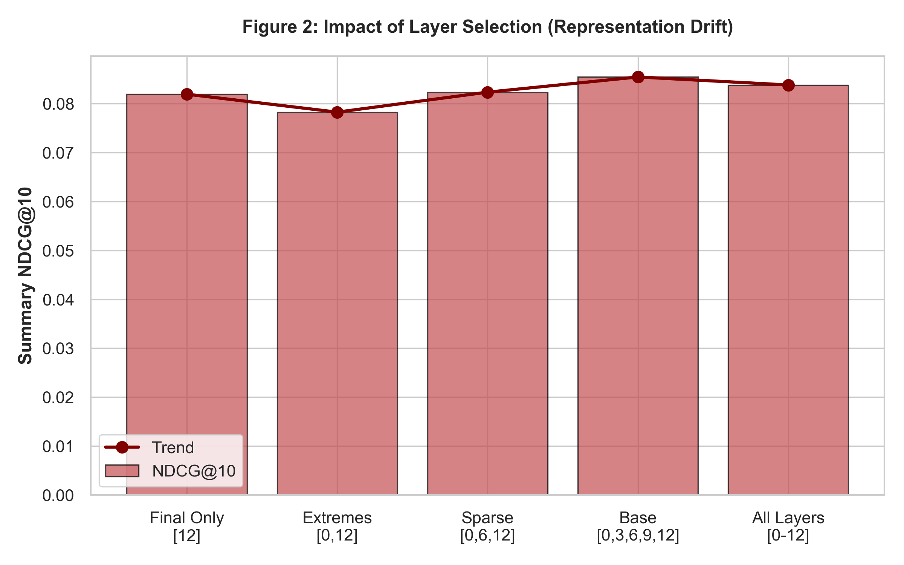
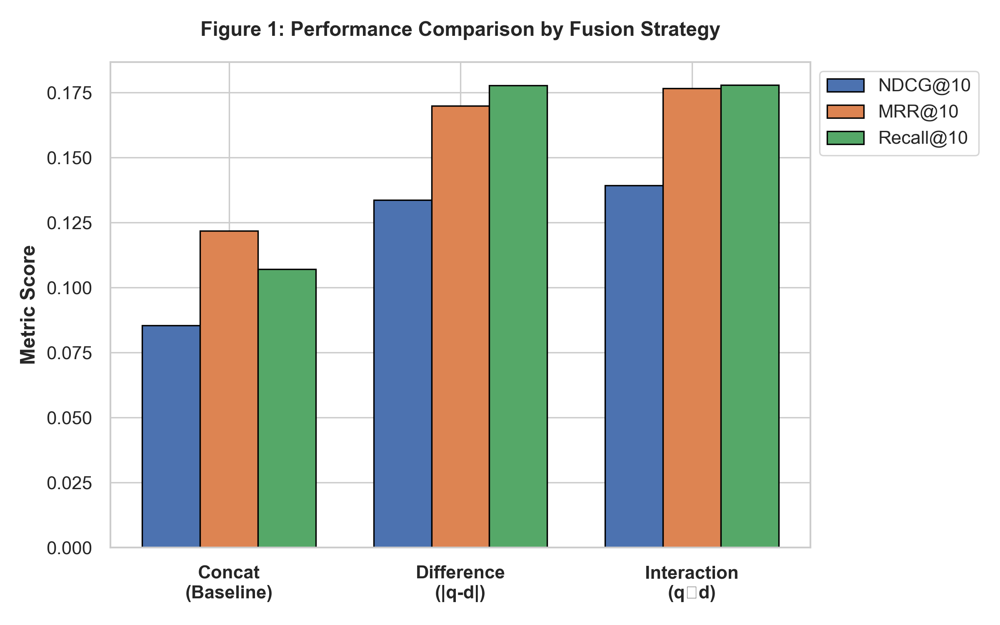
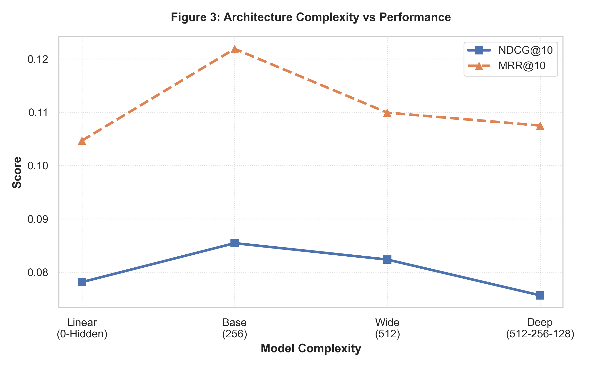
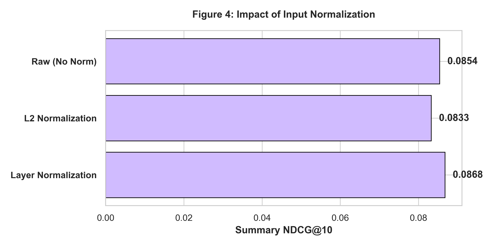
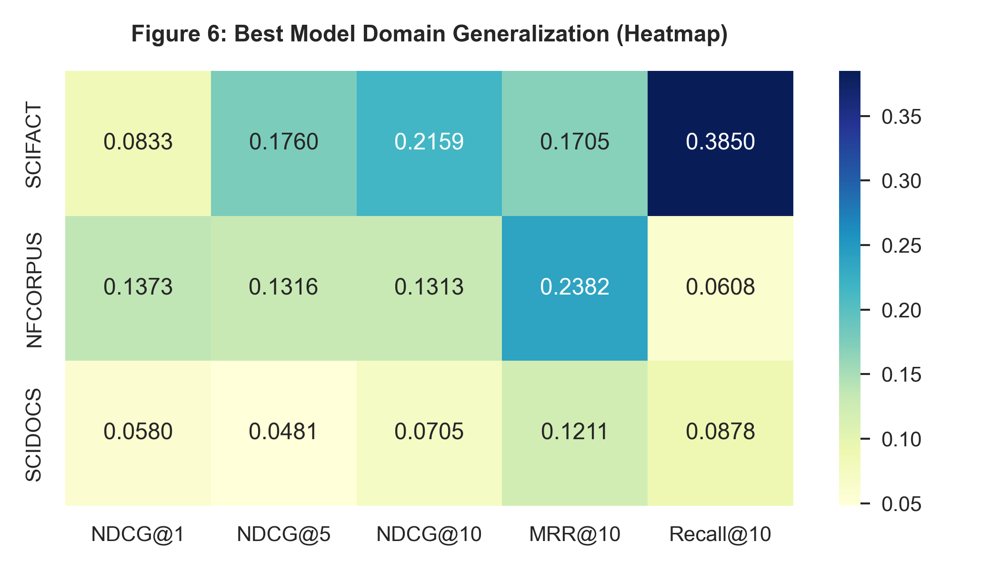
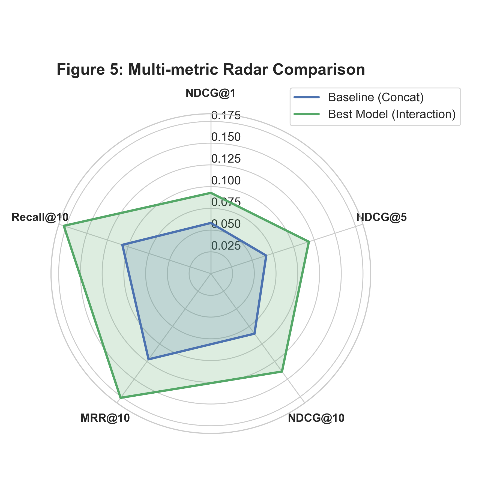

# [1차 실험] ColBERT 내부 레이어 표현을 활용한 Hard Negative Confusion 탐지 최적화 연구

---

## 초록 (Abstract)
본 연구는 ColBERT 모델의 고질적 문제인 Hard Negative (HN) confusion 현상을 해결하기 위해, 동결된 인코더의 다층 표현(multilayer representation)을 활용하는 LayerRouter의 최적 구조를 탐색한다. BEIR 데이터셋을 활용한 Leave-One-Dataset-Out Cross-Validation (LOOCV) 결과, 레이어 간 상호작용(Interaction) 피처와 Layer Normalization을 결합한 구조가 Baseline 대비 NDCG 기준 최대 63.0%의 성능 향상을 기록하였다. 이는 confusion 신호가 특정 레이어에 국한되지 않고 트랜스포머 스택 전반에 걸쳐 누적되는 구조적 특성을 지님을 시사한다.

---

## 1. 서론 (Introduction)
ColBERT와 같은 Late Interaction 모델은 정밀한 토큰 수준 매칭을 수행함에도 불구하고, 어휘적 중첩도가 높은 비정답 문서(HN)를 정답(Positive)보다 높게 랭킹하는 confusion 현상을 빈번히 노출한다. 본 연구는 이러한 confusion이 모델의 내부 표현 공간(Representation Space)에서 이미 전조 증상을 보인다는 가설 하에, 이를 포착하기 위한 최적의 분류기(Router) 아키텍처를 설계하는 데 목적이 있다.

---

## 2. 실험 설계 (Experimental Design)

### 2.1 데이터셋 및 태스크 정의
BEIR 벤치마크 중 도메인 특성이 뚜렷한 SciFact, NFCorpus, SciDocs를 실험 대상으로 선정한다. 태스크는 쿼리-정답-혼동문서로 구성된 triplet $(q, d^+, d^-)$에 대해, 모델이 예측한 confusion score가 실제 MaxSim score의 margin $\Delta = s(q, d^+) - s(q, d^-)$과 높은 상관관계를 갖도록 학습하는 것이다.

### 2.2 평가 프로토콜
도메인 일반화 능력을 검증하기 위해 LOOCV 전략을 채택한다. 3개 데이터셋 중 2개로 학습을 진행하고 나머지 1개로 테스트를 수행하여, 모델이 특정 어휘 분포에 과적합되지 않고 ColBERT의 범용적 레이어 신호를 학습하는지 평가한다.

---

## 3. 실험 결과 및 분석 (Results & Analysis)

### 3.1 레이어 선택 전략 (Layer Selection)
ColBERT의 인코딩 과정 중 어떤 깊이의 정보가 confusion 탐지에 유효한지 검증하였다. 모든 모델은 Concat 융합 및 Raw 정규화를 기본으로 한다.

| 실험 ID | 레이어 구성 | NDCG@1 | NDCG@5 | NDCG@10 | MRR@10 | Recall@10 |
| :--- | :--- | :---: | :---: | :---: | :---: | :---: |
| `abl1_final_only` | [12] | 0.0432 | 0.0637 | 0.0819 | 0.1093 | 0.0978 |
| `abl1_extremes` | [0, 12] | 0.0556 | 0.0596 | 0.0782 | 0.1121 | 0.0825 |
| `abl1_sparse` | [0, 6, 12] | 0.0510 | 0.0655 | 0.0823 | 0.1130 | 0.0967 |
| **Baseline** | **[0, 3, 6, 9, 12]** | **0.0582** | **0.0670** | **0.0854** | **0.1218** | **0.1070** |
| `abl1_all_layers` | [0-12 전 레이어] | 0.0522 | 0.0666 | 0.0837 | 0.1156 | 0.1007 |

  

*   **분석:** 최종 레이어 정보만 사용하는 것보다 중간 레이어를 포함한 다층 구조에서 성능이 높았다. 특히 [0, 3, 6, 9, 12] 조합이 가장 우수했으며, 이는 confusion 신호가 레이어를 거듭하며 점진적으로 형성되는 '표현 표류(Representation Drift)' 과정을 거치기 때문으로 풀이된다.

### 3.2 피처 융합 방식의 영향 (Fusion Strategy)
쿼리와 문서의 레이어 벡터를 결합하는 방식에 따른 성능 차이를 분석하였다.

| 실험 ID | 융합 방식 (Fusion) | NDCG@1 | NDCG@5 | NDCG@10 | MRR@10 | Recall@10 |
| :--- | :--- | :---: | :---: | :---: | :---: | :---: |
| Baseline | Concat | 0.0582 | 0.0670 | 0.0854 | 0.1218 | 0.1070 |
| `abl2_diff_norm` | Difference ($\vert q - d \vert$) | 0.0869 | 0.1093 | 0.1336 | 0.1698 | 0.1661 |
| **`abl2_inter_norm`** | **Interaction ($q \odot d$)** | **0.0928** | **0.1184** | **0.1392** | **0.1766** | **0.1778** |

  

*   **분석:** 가장 극적인 성능 향상은 Interaction 피처 도입 시 발생하였다. 쿼리와 문서 간의 성분별 곱(Hadamard Product)은 두 표현 간의 공통점과 차이점을 신경망에 명시적으로 노출함으로써, Router가 confusion의 근거를 보다 직접적으로 포착하게 한다.

### 3.3 아키텍처 복잡도 및 정규화
신경망의 깊이와 정규화 기법에 따른 일반화 성능을 분석하였다.

| 실험 ID | 아키텍처 / 정규화 | NDCG@1 | NDCG@5 | NDCG@10 | MRR@10 | Recall@10 |
| :--- | :--- | :---: | :---: | :---: | :---: | :---: |
| `abl3_linear` | Linear Probe | 0.0425 | 0.0607 | 0.0781 | 0.1046 | 0.0940 |
| `abl3_wide` | Hidden [512] | 0.0469 | 0.0615 | 0.0823 | 0.1098 | 0.1066 |
| `abl3_deep` | Hidden [512, 256, 128]| 0.0457 | 0.0535 | 0.0756 | 0.1074 | 0.0952 |
| `abl5_l2norm` | L2 Norm | 0.0436 | 0.0632 | 0.0832 | 0.1096 | 0.1064 |
| **`abl5_layernorm`** | **LayerNorm** | **0.0495** | **0.0644** | **0.0867** | **0.1165** | **0.1116** |

  
  

*   **분석:** Confusion 탐지는 얕지만 적절한 너비를 가진 신경망(Hidden 256)에서 가장 잘 작동하였다. 모델이 깊어질수록(`abl3_deep`) 소규모 데이터셋에 대한 과적합이 발생하여 일반화 성능이 저하되었다. 또한, 레이어 간 스케일 편차를 해소하는 Layer Normalization이 성능 안정화에 기여함을 확인하였다.

---

## 4. 최적 모델의 상세 지표 분석 (Detailed Performance)

최적 모델(`abl2_inter_norm`)의 각 데이터셋별 LOOCV 상세 지표는 다음과 같다.

### 표 1: 데이터셋별 상세 성능 지표 (LOOCV Test Results)

  

| 테스트 데이터셋 | NDCG@1 | NDCG@5 | NDCG@10 | MRR@10 | Recall@10 |
| :--- | :---: | :---: | :---: | :---: | :---: |
| **SciFact** | 0.0833 | 0.1759 | 0.2159 | 0.1704 | 0.3849 |
| **NFCorpus** | 0.1372 | 0.1315 | 0.1313 | 0.2381 | 0.0607 |
| **SciDocs** | 0.0580 | 0.0480 | 0.0705 | 0.1211 | 0.0877 |
| **평균 (Mean)** | **0.0928** | **0.1184** | **0.1392** | **0.1766** | **0.1778** |

---

## 5. 최종 라우터 설계 및 시사점

### 5.1 최적 라우터 사양 (Golden Recipe)
1.  **입력:** ColBERT [0, 3, 6, 9, 12] 레이어 Mean-pooled 표현
2.  **정규화:** 입력층 직후 **Layer Normalization** 수행
3.  **피처:** Interaction($q \odot d$) 및 Difference($\vert q - d \vert$) 핵심 활용
4.  **구조:** Single Hidden Layer MLP (256-dim)

### 5.2 결론 (Conclusion)

  

본 연구는 ColBERT의 frozen encoder 내부에 HN confusion을 사전에 탐지할 수 있는 구조적 신호가 존재함을 실증하였다. 특히 쿼리와 문서 표현 간의 직접적인 상호작용 피처가 confusion 예측의 핵심이며, 얕은 신경망 구조만으로도 충분한 도메인 일반화 성능을 확보할 수 있음을 확인하였다. 이 결과는 복잡한 재학습 없이 가벼운 Router만으로도 거대 검색 모델의 실패를 보정할 수 있다는 점에서 높은 실용적 가치를 지닌다. 본 아키텍처는 향후 실제 랭킹 보정(Intervention) 단계의 표준 모델로 채택된다.
